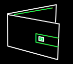
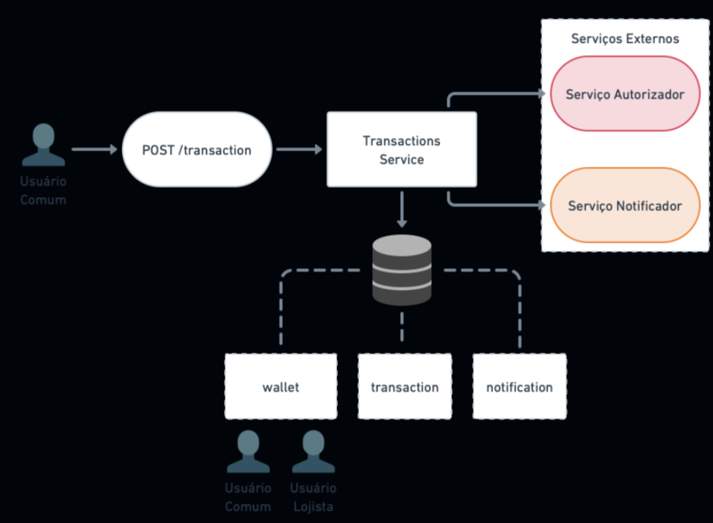

<h1 align="center">
  Simplified Wallet
</h1>
<h2 align="center">
  Sistema de pagamentos simplicado.
</h2>

<p align="center">
  
</p>

<p align="center">
 
 
</p>

Projeto elaborado para solucionar [esse desafio](https://github.com/PicPay/picpay-desafio-backend?tab=readme-ov-file) para uma vaga backend com perfil sênior. A solução desenvolvida é basicamente uma versão simplificada do PicPay. Nela é possível depositar e realizar transferências de dinheiro entre usuários. Temos 2 tipos de usuários, os comuns e lojistas, ambos têm carteira com dinheiro e realizam transferências entre eles.
## API

- http :8080/transaction value=100.0 payer=1 payee=200
```
HTTP/1.1 200
Connection: keep-alive
Content-Type: application/json
Date: Tue, 05 Mar 2024 19:07:52 GMT
Keep-Alive: timeout=60
Transfer-Encoding: chunked

{
"createdAt": "2024-03-05T16:07:50.749774",
"id": 20,
"payee": 2,
"payer": 1,
"value": 100.0
}
```

- http :8080/transaction
```
HTTP/1.1 200
Connection: keep-alive
Content-Type: application/json
Date: Tue, 05 Mar 2024 19:08:13 GMT
Keep-Alive: timeout=60
Transfer-Encoding: chunked

[
{
"createdAt": "2024-03-05T16:07:50.749774",
"id": 20,
"payee": 2,
"payer": 1,
"value": 100.0
}
]
```
## Arquitetura




## Como Executar

- Clonar repositório git:
```
git clone https://github.com/GustavoDaMassa/SimplifiedWallet.git
```
- Executar o Kafka:
```
docker-compose up
```
- Executar a aplicação Spring Boot
- Acessar aplicação em `http://localhost:8080`.


## Tecnologias

- [Spring Boot](https://spring.io/projects/spring-boot)
- [Spring MVC](https://docs.spring.io/spring-framework/reference/web/webmvc.html)
- [Spring Data JDBC](https://spring.io/projects/spring-data-jdbc)
- [Spring for Apache Kafka](https://spring.io/projects/spring-kafka)
- [Docker Compose](https://docs.docker.com/compose/)
- [H2](https://www.h2database.com/html/main.html)
